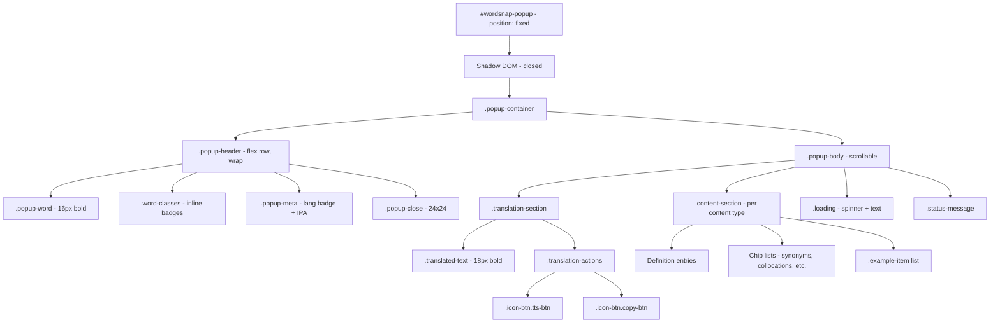

# WordSnap Popup Redesign Plan

> **Date:** 2026-05-25
> **Status:** Analysis Complete — Awaiting Approval
> **Scope:** Popup/overlay UI only (trigger icon + translation popup). Options page not in scope.

---

## Table of Contents

1. [Current State Analysis](#1-current-state-analysis)
2. [Redesign Specification](#2-redesign-specification)
3. [Element-by-Element Redesign](#3-element-by-element-redesign)
4. [Implementation Plan](#4-implementation-plan)

---

## 1. Current State Analysis

### 1.1 Architecture Overview

The popup UI lives entirely in [`src/content/index.ts`](src/content/index.ts:1) as a single 1766-line content script. There are three key constructs:

| Construct | Element ID | Creator | Purpose |
|---|---|---|---|
| **Trigger Icon** | `wordsnap-trigger` | [`createTrigger()`](src/content/index.ts:162) | Floating button shown after text selection |
| **Popup Host** | `wordsnap-popup` | [`createPopup()`](src/content/index.ts:299) | `position: fixed` div, holds Shadow DOM |
| **Shadow Root** | (closed) | [`popupEl.attachShadow()`](src/content/index.ts:313) | Isolates all popup styles from host page |

All CSS lives in the [`getStyles()`](src/content/index.ts:979) function as a ~780-line template literal injected into each Shadow DOM render. There are no external CSS files used by the popup.

### 1.2 Complete UI Element Inventory

#### 1.2.1 Trigger Icon (`#wordsnap-trigger`)

| Property | Current Value |
|---|---|
| Size | 36×36px (CSS width/height) |
| Border-radius | 12px |
| Border | 1px solid `rgba(255,255,255,0.22)` |
| Background | `linear-gradient(135deg, #2563EB 0%, #1D4ED8 100%)` |
| Box-shadow | `0 14px 30px rgba(37,99,235,0.28), 0 4px 10px rgba(15,23,42,0.18)` |
| Backdrop-filter | `blur(10px)` |
| Hover transform | `translateY(-1px) scale(1.04)` |
| Hover shadow | `0 18px 34px rgba(37,99,235,0.34), 0 8px 16px rgba(15,23,42,0.2)` |
| Icon | Inline SVG (16×16, stroke: white, viewBox 0-24) — a book/spine icon |

#### 1.2.2 Popup Container (Shadow DOM → `.popup-container`)

| Property | Current Value |
|---|---|
| Max-width | 420px (anchored), 380px (sheet) |
| Max-height | `min(560px, calc(100vh - 24px))` |
| Border | 1px solid `--color-border` |
| Border-radius | 20px (anchored), 22px (sheet) |
| Background | `linear-gradient(180deg, rgba(255,255,255,0.98), var(--color-bg))` |
| Box-shadow | `0 24px 48px rgba(15,23,42,0.16), 0 10px 20px rgba(15,23,42,0.1)` |
| Backdrop-filter | `blur(18px)` |
| Display | flex, flex-direction: column |
| Animation | `popupIn` 200ms: `translateY(6px) scale(0.985)` → identity |
| Font | Inter, 14px base, line-height: 1.55 |

#### 1.2.3 Popup Header (sticky, `.popup-header`)

| Property | Current Value |
|---|---|
| Position | sticky, top: 0, z-index: 2 |
| Padding | 18px 18px 16px |
| Border-bottom | 1px solid `--color-border` |
| Background | `linear-gradient(180deg, rgba(248,250,252,0.98), rgba(255,255,255,0.94))` |
| Backdrop-filter | `blur(18px)` |
| Gap | 14px (flex-direction: column) |

**Header sub-elements:**

| Element | Class | Current Styling |
|---|---|---|
| Header main row | `.popup-header-main` | flex row, gap: 12px, align-items: flex-start |
| Header copy column | `.popup-header-copy` | flex column, gap: 8px, flex: 1 |
| Eyebrow label | `.popup-eyebrow` | 11px, weight 700, uppercase, letter-spacing 0.08em, color: primary blue |
| Title row | `.popup-title-row` | flex wrap row, gap: 8px |
| Word display | `.popup-word` | 20px, weight 800, letter-spacing -0.03em, white-space: nowrap, text-overflow: ellipsis |
| Loading subtitle | `.popup-subtitle` | 12px, secondary text color |
| Source label | `.popup-source-label` | 12px, secondary text color |
| Meta row | `.popup-meta-row` | flex wrap row, gap: 8px (phonetics + source) |
| Word class badges | `.word-class-badge` | 11px, weight 700, pill (999px radius), 4px 10px padding, gradient bg + inset shadow + border |
| Close button | `.popup-close` | 40×40px min-size, border-radius 12px, white bg + border |

#### 1.2.4 Popup Body (`.popup-body`)

| Property | Current Value |
|---|---|
| Padding | 16px 18px 18px |
| Overflow-y | auto, overscroll-behavior: contain |
| Display | grid, align-content: start, gap: 14px |
| Custom scrollbar | thin, 8px width, rounded thumb |

#### 1.2.5 Body Sub-sections

| Section | Class(es) | Current Styling |
|---|---|---|
| **Meta info** (word/sentence count) | `.meta-info` | flex row, gap 8px, padding 10px 12px, border-radius 16px, gradient bg + border |
| **Meta badges** | `.meta-badge`, `.lang-badge` | 11px weight 700, pill shape, 4px 8px padding, bordered |
| **Translation hero** | `.hero-card.translation-hero` | padding 16px, border-radius 16px, gradient bg, inset shadow, blue-tinted |
| **Hero topline** | `.hero-card-topline` | flex row, space-between, margin-bottom 12px |
| **Hero label** | `.hero-label` | 11px weight 700, uppercase, letter-spacing 0.08em |
| **Translated text** | `.translated-text` | 24px, weight 800, letter-spacing -0.03em, line-height 1.34 |
| **Translation row** | `.hero-translation-row` | flex row, gap 14px |
| **TTS button** | `.tts-btn` | 40×40px min, border-radius 12px, bordered |
| **Copy button** | `.copy-btn` | 40×40px min, border-radius 12px, bordered |
| **Copy success** | `.copy-btn.copied` | green bg, white text |
| **Section nav** | `.section-nav` | flex wrap row, gap 8px |
| **Section chips** | `.section-chip` | 36px min-height, 8px 12px padding, pill shape, weight 700, 12px font |
| **Accent chip** | `.section-chip-accent` | purple-tinted variant |
| **Detail stack** | `.detail-stack` | grid, gap 12px |
| **Detail group** | `.detail-group` | grid, gap 12px, scroll-margin-top 12px |
| **Generic section card** | `.section` | padding 14px, border-radius 16px, gradient bg + border |
| **Section title** | `.section-title` | 11px weight 700, uppercase, letter-spacing 0.08em, margin-bottom 10px |
| **Error state** | `.error` | red-tinted bg + border, 13px font, 12px 14px padding, 14px radius |
| **Same-lang notice** | `.same-lang-notice` | blue-tinted gradient, 14px 16px padding, 16px radius, italic text |
| **Alternatives list** | `.alt-list`, `.syn-list` | flex wrap, gap 8px |
| **Alt chip** | `.alt-chip` | 12px, 7px 10px padding, pill, blue-tinted |
| **Synonym chip** | `.syn-chip` | 12px, 7px 10px padding, pill, neutral |
| **Collocation chip** | `.collocation-chip` | same base, purple-tinted |
| **Grammar chip** | `.grammar-chip` | same base, teal-tinted |
| **IPA group** | `.ipa-group` | inline-flex, gap 4px |
| **IPA label** | `.ipa-label` | 10px weight 700, uppercase, letter-spacing 0.05em |
| **IPA value** | `.ipa` | 12px, italic, pill bg, 4px 8px padding, bordered |
| **Audio button** | `.audio-btn` | 30×30px min, pill, bordered, primary color |
| **GT definition entry** | `.gt-def-entry` | flex row, gap 8px, 10px 12px padding, 12px radius, card bg + border |
| **Cambridge def entry** | `.def-entry` | 12px padding, border-left 3px accent, 12px radius, card bg + border |
| **POS badge** | `.pos` | 10px weight 700, uppercase, pill, neutral |
| **Meaning text** | `.meaning` | 13px, line-height 1.55 |
| **Definition examples** | `.def-examples` | grid, gap 4px, margin-top 6px |
| **Example text** | `.def-example`, `.example` | 12px, italic, secondary color, line-height 1.5 |
| **Generic examples** | `.examples` | grid, gap 8px, margin-top 10px |
| **Example card** | `.example` | 11px 12px padding, border-left 3px accent, 12px radius, card bg |
| **Technical card** | `.technical-card` | 12px 14px padding, 14px radius, card bg |
| **Technical term** | `.technical-term` | 13px weight 700 |
| **Technical domain** | `.technical-domain` | 10px weight 700, uppercase, pill, purple-tinted |
| **Loading state** | `.loading` | flex row, gap 12px, min-height 88px |
| **Spinner** | `.spinner` | 18×18px, 2px border, primary top-color, infinite spin 0.7s |
| **Expand button** | `.expand-btn` | no bg/border, primary color, 12px weight 700 |
| **Retry button** | `.retry-btn` | inline button for failed state |

### 1.3 Current Color Palette

| Role | Light Value | Notes |
|---|---|---|
| Primary brand | `#1d4ed8` → `#1e40af` | Blue-700/800 range |
| Primary soft | `#dbeafe` | Blue-100 |
| Background | `rgba(255,255,255,0.98)` | Near-white with slight transparency |
| Surface | `#f8fafc` | Slate-50 |
| Surface strong | `#ffffff` | Pure white |
| Surface muted | `#e2e8f0` | Slate-200 |
| Surface contrast | `#eef2ff` | Indigo-50 |
| Text primary | `#0f172a` | Slate-900 |
| Text secondary | `#334155` | Slate-700 |
| Text muted | `#475569` | Slate-600 |
| Text subtle | `#64748b` | Slate-500 |
| Border | `rgba(100,116,139,0.34)` | Semi-transparent slate |
| Border strong | `rgba(71,85,105,0.5)` | Darker semi-transparent |
| Success | `#15803d` | Green-700 |
| Error | `#b91c1c` | Red-700 |
| **Chip variants:** | | |
| Neutral chip | bg `#f8fafc`, border `#cbd5e1`, text `#334155` | |
| Info chip | bg `#eff6ff`, border `#93c5fd`, text `#1d4ed8` | |
| Accent chip | bg `#f5f3ff`, border `#c4b5fd`, text `#6d28d9` | |
| Teal chip | bg `#ecfeff`, border `#67e8f9`, text `#0f766e` | |
| **Word class badge:** | `linear-gradient(180deg, rgba(29,78,216,0.14), rgba(29,78,216,0.07))` + inset shadow | Unique gradient |

### 1.4 Identified Problems (Wasted Space & Visual Clutter)

1. **Excessive padding**: 18px header padding, 16-18px body padding, 14px section padding, 14px body gap — these compound to push content out of view.
2. **Oversized interactive elements**: Close/TTS/Copy buttons at 40×40px minimum are larger than needed for a compact popup.
3. **Gradient backgrounds everywhere**: Container, header, hero cards, every section card, word-class badges all use gradients. No solid backgrounds.
4. **Heavy shadows**: 24px+48px spread on the container, plus per-card shadows. Creates visual weight.
5. **Backdrop-filter blur**: `blur(18px)` on container and header — expensive to render, achieves little with near-opaque backgrounds.
6. **Large border-radius**: 20px container, 16px cards, 14px buttons, 12px chips. Roundness adds perceived size.
7. **Decorative-only elements**: The `.popup-eyebrow` "WordSnap" label consumes ~30px of header height with no functional value. The `.popup-subtitle` in loading state is redundant with the loading message below.
8. **Redundant wrappers**: `.popup-header-copy` nests inside `.popup-header-main` which nests inside `.popup-header`. The `.popup-title-row` wraps the word + badges but could be a single flex row.
9. **Section navigation chips**: These add ~44px of height before any content, duplicating the natural scroll-to-section behavior.
10. **Card-in-card pattern**: Sections wrap content in `.section` cards that already sit inside the bordered container — double borders.
11. **Many color chip variants**: 4 distinct chip color schemes (neutral, info/blue, accent/purple, teal) make the popup visually busy.
12. **Large translated text**: 24px weight 800 is appropriate for a hero, but the `line-height: 1.34` and gap: 14px on the row waste vertical space.
13. **Sticky header** with 18px padding occupies significant non-scrollable area on small viewports.
14. **Empty containers possible**: `sectionItems` array builds sections conditionally, but `.detail-stack` always renders even if empty.

---

## 2. Redesign Specification

### 2.1 Layout Principles

- **Compact box model**: Every element gets minimum viable padding (2–4px for inline items, 6–8px for block items).
- **Content-driven sizing**: The popup width shrinks to fit content; no fixed minimum width beyond readability floor.
- **No empty containers**: Every wrapper div must contain visible content or be conditionally omitted.
- **Flat structure**: Reduce nesting depth; eliminate decorative-only wrapper elements.
- **Single border perimeter**: The popup container is the only bordered element. Inner sections use background contrast only, no nested borders.

### 2.2 Typography

| Role | Size | Weight | Line-height | Notes |
|---|---|---|---|---|
| Headword | 16px | 700 | 1.2 | Down from 20px/800; single line, ellipsis overflow |
| Translated text | 18px | 700 | 1.25 | Down from 24px/800 |
| Section heading | 12px | 600 | 1.2 | Down from 11px/700 uppercase; normal case |
| Body text | 13px | 400 | 1.3 | Down from 14px/1.55 |
| Small labels | 11px | 500 | 1.2 | For POS tags, IPA, badges |
| Chip text | 11px | 500 | 1.2 | Unified chip size |

**Font stack:** `-apple-system, BlinkMacSystemFont, 'Segoe UI', sans-serif` (drop Inter to avoid external font dependency for the popup; the host page may not have it).

### 2.3 Color Palette (5 Colors + 2 Semantic)

| Token | Hex | Role |
|---|---|---|
| `--bg` | `#ffffff` | Container background (solid) |
| `--bg-alt` | `#f5f5f5` | Subtle section contrast background |
| `--text` | `#1a1a1a` | Primary text |
| `--text-secondary` | `#6b6b6b` | Secondary/muted text |
| `--border` | `#e0e0e0` | Single border color for all dividers |
| `--accent` | `#2563eb` | Links, focus rings, primary actions |
| `--error` | `#dc2626` | Error states only |

**Dark mode overrides:**

| Token | Hex |
|---|---|
| `--bg` | `#1a1a1a` |
| `--bg-alt` | `#242424` |
| `--text` | `#e8e8e8` |
| `--text-secondary` | `#9a9a9a` |
| `--border` | `#3a3a3a` |
| `--accent` | `#60a5fa` |
| `--error` | `#f87171` |

### 2.4 Borders

- **Container**: 1px solid `--border`
- **Section dividers**: 1px solid `--border` (horizontal rules only, not full border boxes)
- **No nested borders on cards or chips**
- **Border-radius**: Container 6px, buttons 4px, chips 12px (pill). No other border-radius.

### 2.5 Backgrounds

- Solid `--bg` for container
- Solid `--bg-alt` for alternating/contrast section backgrounds
- **No gradients anywhere**
- **No box-shadows** (rely on border for definition)
- **No backdrop-filter**

### 2.6 Icons

- **Keep**: Close (×), Copy, Speaker (TTS), Play (audio pronunciation)
- **Remove**: The book/spine SVG in the trigger icon — replace with a simple text label or single letter glyph. The section-badge decorative SVGs (in options page only — not in popup scope).
- All functional icons: 14×14px or 16×16px, `currentColor` stroke, no decorative backgrounds.

### 2.7 Spacing Rules

| Context | Padding | Margin/Gap |
|---|---|---|
| Container | 8px | — |
| Header area | 6px 8px | border-bottom: 1px, then 6px gap to body |
| Body area | 6px 8px 8px | — |
| Section block | 4px 0 | 4px gap between sections |
| Section heading | 0 | 2px below heading |
| Inline row (phonetics, badges) | 0 | 4px gap |
| Chips/tags | 2px 6px | 3px gap |
| Buttons (small: close, copy, tts, audio) | 0 (icon-only) | 24×24px min target |
| Translation row | 0 | 4px gap between text and action buttons |
| Divider (`<hr>`) | 0 | 4px vertical margin |
| Definition entry | 4px 0 | 6px gap between entries |
| Definition example | 2px 0 | 2px gap |

### 2.8 Content-Driven Sizing

- **Width**: `width: max-content` with `max-width: min(380px, calc(100vw - 16px))`. No `min-width`.
- **Height**: `max-height: min(480px, calc(100vh - 16px))` (down from 560px).
- The popup grows and shrinks vertically based on content; no empty space at bottom.
- If content overflows max-height, body scrolls. Header remains in flow (not sticky — the popup is small enough).

### 2.9 Trigger Icon Redesign

- Reduce size to 28×28px (from 36×36px)
- Border-radius: 6px (from 12px)
- Background: solid `--accent` (no gradient)
- Border: 1px solid `--border`
- **Remove**: box-shadow, backdrop-filter, hover transform/scale animation
- Hover: slightly darker background (`--accent` at 90% opacity)
- Icon: simple text "T" (for Translate) or a minimal 14px SVG, centered

---

## 3. Element-by-Element Redesign

### 3.1 Trigger Icon (`#wordsnap-trigger`)

```css
width: 28px;
height: 28px;
border-radius: 6px;
border: 1px solid var(--border);
background: var(--accent);
color: #ffffff;
display: flex;
align-items: center;
justify-content: center;
cursor: pointer;
/* REMOVED: box-shadow, backdrop-filter, gradient, hover transform/scale */
```

**Hover state:**
```css
background: #1d4ed8; /* slightly darker accent */
```

**Structural change:** Replace the 16×16 book SVG with a simple 14×14 text-glyph SVG or just the letter "T" in white.

### 3.2 Popup Host (`#wordsnap-popup`)

```css
position: fixed;
z-index: 2147483647;
display: none;
font-family: -apple-system, BlinkMacSystemFont, 'Segoe UI', sans-serif;
/* REMOVED: width, min-width, max-width constraints on host */
```

Width/height constraints move to the inner `.popup-container` inside Shadow DOM. The host element is purely a positioning wrapper.

### 3.3 Popup Container (`.popup-container`)

```css
width: max-content;
max-width: min(380px, calc(100vw - 16px));
max-height: min(480px, calc(100vh - 16px));
border: 1px solid var(--border);
border-radius: 6px;
background: var(--bg);
color: var(--text);
font-size: 13px;
line-height: 1.3;
display: flex;
flex-direction: column;
overflow: hidden;
/* REMOVED: box-shadow, backdrop-filter, gradient, animation, min-width */
```

**Animation:** Keep `popupIn` but simplify to `opacity 0→1` only (no transform), 120ms duration, disabled if `prefers-reduced-motion`.

### 3.4 Header Area

**Merge** `.popup-header` + `.popup-header-main` + `.popup-header-copy` into a single flat header:

```html
<div class="popup-header">
  <span class="popup-word">example</span>
  <span class="word-classes">...</span>
  <span class="popup-meta">...</span>
  <button class="popup-close">×</button>
</div>
```

```css
.popup-header {
  display: flex;
  flex-wrap: wrap;
  align-items: center;
  gap: 4px;
  padding: 6px 8px;
  border-bottom: 1px solid var(--border);
  background: var(--bg);
}
.popup-word {
  font-size: 16px;
  font-weight: 700;
  line-height: 1.2;
  color: var(--text);
  max-width: 240px;
  overflow: hidden;
  text-overflow: ellipsis;
  white-space: nowrap;
}
.popup-close {
  margin-left: auto;
  width: 24px;
  height: 24px;
  padding: 0;
  border: none;
  background: none;
  color: var(--text-secondary);
  cursor: pointer;
  font-size: 16px;
  line-height: 1;
  display: inline-flex;
  align-items: center;
  justify-content: center;
  border-radius: 4px;
}
.popup-close:hover {
  color: var(--text);
  background: var(--bg-alt);
}
```

**REMOVED elements:**
- `.popup-eyebrow` (brand label) — entirely removed
- `.popup-title-row` wrapper — flattened
- `.popup-header-main` wrapper — flattened
- `.popup-header-copy` wrapper — flattened
- `.popup-source-label` — merged into `.popup-meta`
- `.popup-meta-row` wrapper — flattened
- `.popup-subtitle` (loading state only) — replaced by loading spinner text

### 3.5 Close Button SVG

Replace the 2-line × SVG with a simple text `×` character (or keep SVG but reduce to 14×14, no decorative border).

### 3.6 Popup Body (`.popup-body`)

```css
.popup-body {
  padding: 6px 8px 8px;
  overflow-y: auto;
  overscroll-behavior: contain;
  display: flex;
  flex-direction: column;
  gap: 4px;
  scrollbar-width: thin;
  scrollbar-color: var(--border) transparent;
}
.popup-body::-webkit-scrollbar { width: 6px; }
.popup-body::-webkit-scrollbar-thumb {
  background: var(--border);
  border-radius: 3px;
}
```

### 3.7 Translation Section

Flatten translation-hero into a simple block:

```html
<div class="translation-section">
  <div class="translated-text">Nghĩa của từ</div>
  <div class="translation-actions">
    <button class="icon-btn tts-btn" title="Listen">🔊</button>
    <button class="icon-btn copy-btn" title="Copy">📋</button>
  </div>
</div>
```

```css
.translation-section {
  padding: 4px 0;
  border-bottom: 1px solid var(--border);
}
.translated-text {
  font-size: 18px;
  font-weight: 700;
  line-height: 1.25;
  color: var(--text);
  word-break: break-word;
}
.translation-actions {
  display: flex;
  gap: 4px;
  margin-top: 2px;
}
.icon-btn {
  width: 24px;
  height: 24px;
  padding: 0;
  border: none;
  background: none;
  color: var(--text-secondary);
  cursor: pointer;
  border-radius: 4px;
  display: inline-flex;
  align-items: center;
  justify-content: center;
}
.icon-btn:hover {
  color: var(--accent);
  background: var(--bg-alt);
}
.copy-btn.copied {
  color: #16a34a; /* success green */
}
```

**REMOVED:** `.hero-card`, `.hero-card-topline`, `.hero-label`, `.hero-lang-badge`, `.hero-translation-row`, `.translation-row`, `.translation-actions-hero`. The language badge (EN→VI) moves into the header meta area.

### 3.8 Language Badge

```html
<span class="lang-badge">EN → VI</span>
```

```css
.lang-badge {
  font-size: 10px;
  font-weight: 500;
  color: var(--text-secondary);
  padding: 1px 4px;
  background: var(--bg-alt);
  border-radius: 3px;
}
```

### 3.9 Word Class Badges

```css
.word-class-badge {
  font-size: 11px;
  font-weight: 500;
  padding: 1px 5px;
  border-radius: 12px;
  background: var(--bg-alt);
  color: var(--text-secondary);
  /* REMOVED: gradient, inset shadow, border, min-height */
}
```

### 3.10 Phonetics Row

```css
.phonetics {
  display: flex;
  flex-wrap: wrap;
  align-items: center;
  gap: 4px;
}
.ipa-group {
  display: inline-flex;
  align-items: center;
  gap: 2px;
}
.ipa-label {
  font-size: 9px;
  font-weight: 500;
  color: var(--text-secondary);
}
.ipa {
  font-size: 11px;
  color: var(--text);
  /* REMOVED: italic, pill background, border, padding */
}
.audio-btn {
  width: 20px;
  height: 20px;
  padding: 0;
  border: none;
  background: none;
  color: var(--accent);
  cursor: pointer;
  border-radius: 3px;
}
.audio-btn:hover {
  background: var(--bg-alt);
}
```

### 3.11 Section Navigation — REMOVE

The `.section-nav` and `.section-chip` elements are removed entirely. The popup is compact enough that users can scroll to see all content. This removes ~44px of vertical space and the cognitive load of multiple navigation chips.

### 3.12 Section Cards → Flat Sections

Replace `.section` cards with simple content blocks separated by thin dividers:

```css
.content-section {
  padding: 4px 0;
}
.content-section + .content-section {
  border-top: 1px solid var(--border);
  padding-top: 6px;
}
.section-heading {
  font-size: 12px;
  font-weight: 600;
  line-height: 1.2;
  color: var(--text);
  margin-bottom: 2px;
}
```

**REMOVED:** `.section` card styling (padding 14px, border-radius 16px, gradient bg, border).

### 3.13 Definition Entries

```css
.def-entry {
  padding: 4px 0;
}
.def-entry + .def-entry {
  margin-top: 6px;
}
.pos {
  font-size: 11px;
  font-weight: 500;
  color: var(--text-secondary);
}
.pos::after {
  content: ' — ';
}
.meaning {
  font-size: 13px;
  color: var(--text);
  line-height: 1.3;
}
.def-examples {
  margin-top: 2px;
}
.def-example {
  font-size: 12px;
  color: var(--text-secondary);
  font-style: italic;
  line-height: 1.3;
  padding-left: 8px;
  border-left: 2px solid var(--border);
}
```

**REMOVED:** Card backgrounds, border-left accent on entries, pill POS tags, border-radius on entries.

### 3.14 Chips (Synonyms, Alternatives, Collocations, Grammar)

Unify all chip variants into a single style:

```css
.chip {
  display: inline-block;
  font-size: 11px;
  font-weight: 500;
  padding: 2px 6px;
  border-radius: 12px;
  background: var(--bg-alt);
  color: var(--text);
}
.chip-list {
  display: flex;
  flex-wrap: wrap;
  gap: 3px;
}
```

**REMOVED:** All chip color variants (`.alt-chip` blue, `.collocation-chip` purple, `.grammar-chip` teal, `.syn-chip` neutral). All chips use the same `--bg-alt` background.

### 3.15 Examples Section

```css
.example-item {
  font-size: 12px;
  color: var(--text-secondary);
  font-style: italic;
  line-height: 1.3;
  padding: 2px 0 2px 8px;
  border-left: 2px solid var(--border);
}
.example-item + .example-item {
  margin-top: 4px;
}
```

### 3.16 Error / Status Messages

```css
.status-message {
  font-size: 12px;
  padding: 4px 6px;
  border-radius: 3px;
}
.status-error {
  color: var(--error);
  background: #fef2f2; /* light red tint, unchanged in dark mode */
  border: 1px solid #fecaca;
}
.status-info {
  color: var(--text-secondary);
  background: var(--bg-alt);
}
```

### 3.17 Loading State

```css
.loading {
  display: flex;
  align-items: center;
  gap: 8px;
  padding: 8px 0;
  min-height: 40px; /* down from 88px */
}
.spinner {
  width: 14px;  /* down from 18px */
  height: 14px;
  border: 2px solid var(--border);
  border-top-color: var(--accent);
  border-radius: 50%;
  animation: spin 0.6s linear infinite;
  flex-shrink: 0;
}
.loading-text {
  font-size: 12px;
  color: var(--text-secondary);
}
```

**REMOVED:** `.hero-card-loading`, `.loading-copy` with `strong` + `span` two-line structure. Single line: "Translating…" is sufficient.

### 3.18 Expand Button

```css
.expand-btn {
  background: none;
  border: none;
  color: var(--accent);
  font-size: 11px;
  cursor: pointer;
  padding: 2px 0;
  font-weight: 500;
}
.expand-btn:hover {
  text-decoration: underline;
}
```

### 3.19 Same-Language Notice

```css
.same-lang-notice {
  padding: 4px 0;
  font-size: 12px;
  color: var(--text-secondary);
  font-style: italic;
}
```

**REMOVED:** Gradient bg, border, border-radius, pill badge.

### 3.20 Meta Info (Word/Sentence Count)

```css
.meta-info {
  display: flex;
  gap: 6px;
  flex-wrap: wrap;
  padding: 2px 0;
}
.meta-badge {
  font-size: 10px;
  color: var(--text-secondary);
}
```

### 3.21 Technical Usage Cards

```css
.technical-item {
  padding: 4px 0;
}
.technical-item + .technical-item {
  border-top: 1px solid var(--border);
  margin-top: 4px;
  padding-top: 6px;
}
.technical-term {
  font-size: 13px;
  font-weight: 600;
  color: var(--text);
}
.technical-domain {
  font-size: 10px;
  color: var(--text-secondary);
  margin-left: 4px;
}
```

### 3.22 Retry Button

```css
.retry-btn {
  background: var(--bg-alt);
  border: 1px solid var(--border);
  color: var(--accent);
  font-size: 11px;
  padding: 3px 8px;
  border-radius: 4px;
  cursor: pointer;
}
.retry-btn:hover {
  background: var(--border);
}
```

### 3.23 DOM Structure Changes Summary

| Current Element | Action |
|---|---|
| `.popup-eyebrow` | **Remove** |
| `.popup-subtitle` | **Remove** (merge into loading text) |
| `.popup-header-main` | **Flatten** into `.popup-header` |
| `.popup-header-copy` | **Flatten** into `.popup-header` |
| `.popup-title-row` | **Flatten** into `.popup-header` |
| `.popup-meta-row` | **Flatten** into `.popup-header` |
| `.hero-card` | **Replace** with `.translation-section` |
| `.hero-card-topline` | **Remove** |
| `.hero-label` | **Remove** |
| `.hero-lang-badge` | **Move** to header |
| `.hero-translation-row` | **Flatten** |
| `nav.section-nav` | **Remove entirely** |
| `.section-chip*` | **Remove entirely** |
| `.detail-stack` / `.detail-group` | **Flatten** into `.content-section` blocks |
| `.section` card wrapper | **Replace** with flat dividers |
| `.meta-info` card | **Simplify** to plain row |
| `.loading-copy` two-line | **Merge** to single line |
| `.hero-card-loading` | **Remove** gradient variant |
| POS badges (`3px 8px` pill) | **Simplify** to inline text with `::after` |
| IPA value pills | **Remove** pill background |

---

## 4. Implementation Plan

### 4.1 Files to Change (in order)

| # | File | Change |
|---|---|---|
| 1 | [`src/content/index.ts`](src/content/index.ts:1) | Rewrite `getStyles()` CSS template; restructure HTML generation in `renderLoading()` and `renderResult()`; update trigger icon in `createTrigger()` |
| 2 | No other files | The popup is fully self-contained in this single file |

### 4.2 Approach: Inline Styles in Content Script

**Recommendation:** Keep all CSS in the `getStyles()` function as a template literal. This is the correct pattern for a content script using Shadow DOM because:

1. No external CSS files can be loaded into a Shadow DOM from a content script without complex URL resolution.
2. The styles are isolated from the host page — no need for CSS modules or build-time extraction.
3. A single template literal is easy to maintain, diff, and reason about in this context.
4. The current approach already works; the redesign only reduces the CSS volume (~780 lines → ~350 lines).

**Do NOT:**
- Create a separate `.css` file
- Use CSS-in-JS libraries
- Use `@import` or `link` in Shadow DOM

### 4.3 Code Structure Changes

1. **`getStyles()` function** (line 979–1757): Replace entire CSS string with redesigned version. Reduce token count from ~40 custom properties to ~10.

2. **`renderLoading()` function** (line 409–438): Simplify HTML structure:
   - Remove `.popup-eyebrow`
   - Remove `.popup-subtitle`
   - Flatten header wrappers
   - Reduce loading block to spinner + "Translating…" text only

3. **`renderResult()` function** (line 467–924): Significant HTML restructuring:
   - Flatten header: single `.popup-header` with word, badges, meta, close
   - Replace `.hero-card` block with `.translation-section`
   - Remove `sectionItems` array and `sectionNavHtml` generation entirely
   - Replace `.detail-stack` / `.detail-group` pattern with flat `.content-section` divs
   - Simplify all chip generation to use single `.chip` class
   - Simplify definition entry HTML
   - Remove all card wrappers (`.section`, `.hero-card`, `.meta-info` as card)

4. **`createTrigger()` function** (line 162–210): Simplify trigger styling:
   - Reduce size to 28×28px
   - Replace gradient with solid color
   - Remove box-shadow, backdrop-filter
   - Remove hover transform/scale listeners
   - Simplify SVG icon

5. **Event listeners** (within `renderResult`): No structural changes needed — all query selectors map to class names that persist (`.popup-close`, `.audio-btn`, `.tts-btn`, `.copy-btn`, `.expand-btn`, `.retry-btn`).

### 4.4 Migration Path (Single Phase)

Since the popup redesign is fully contained in one file with no API changes:

1. Rewrite `getStyles()` first with the full new CSS
2. Update `renderLoading()` HTML
3. Update `renderResult()` HTML section by section, testing each
4. Update `createTrigger()` trigger icon
5. Test both viewport modes (anchored + sheet)
6. Test dark mode
7. Test all interactive elements (close, TTS, copy, audio, expand, retry)

### 4.5 Design Tokens (Final CSS Variable Set)

```css
:host {
  --bg: #ffffff;
  --bg-alt: #f5f5f5;
  --text: #1a1a1a;
  --text-secondary: #6b6b6b;
  --border: #e0e0e0;
  --accent: #2563eb;
  --error: #dc2626;
  --radius: 6px;
  --font: -apple-system, BlinkMacSystemFont, 'Segoe UI', sans-serif;
}
```

This replaces the current ~40 custom properties with 9.

---

## Appendix A: Popup Size Comparison

| Metric | Current | Redesign | Delta |
|---|---|---|---|
| Container max-width | 420px | 380px | −40px |
| Container max-height | 560px | 480px | −80px |
| Header padding | 18px 18px 16px | 6px 8px | −12px vertical |
| Body padding | 16px 18px 18px | 6px 8px 8px | −12px vertical |
| Section gap | 14px | 4px | −10px |
| Button min-size | 40×40px | 24×24px | −16px |
| Translated text | 24px | 18px | −6px |
| Headword | 20px | 16px | −4px |
| Border-radius | 20px | 6px | −14px |
| Body font | 14px/1.55 | 13px/1.3 | tighter |
| Section nav | 44px height | 0 (removed) | −44px |
| Eyebrow label | ~20px height | 0 (removed) | −20px |
| **Estimated height savings for a typical 3-definition result** | ~560px (often clipped) | ~220–320px | ~**40–50% reduction** |

## Appendix B: Mermaid Diagram — Popup DOM Structure (Redesign)



---

*End of plan.*
